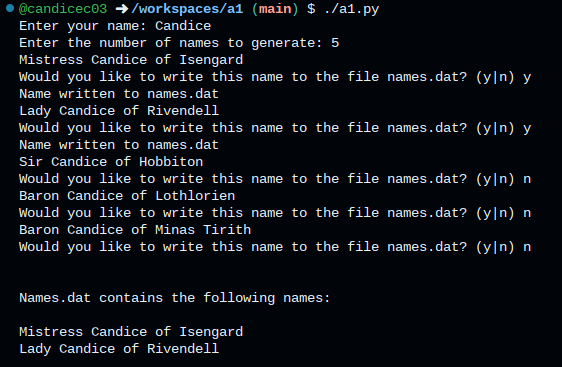

# Assignment 1
## Permitted aids and time
You are allowed to use all provided course materials for reference. Do not use AI.

## Instructions

- Open the provided templates **a1.py**. Note the comment block at the top is the only thing that has been provided in this template.

- Modify the comment block to include:
    - Author: Your name; your email
    - Date: Today's date

### a1.py
- Define a function called **combine** that accepts 3 arguments:
    - **prefix**
    - **name**
    - **place**

- Return the following string:
    - return prefix name of place

- Import the random module
- Using the following prompt, prompt the user to input a name: "Enter a name: ". Store this in the variable name.
- Using the following prompt, prompt the user to input a number of titles to generate: "Enter the number of titles to generate: ". Store this in the variable numTitles.

- Create the following list of **prefixes**:
    - Sir
    - Lady
    - Lord
    - Dame
    - Master
    - Mistress
    - King
    - Queen
    - Prince
    - Princess

- Create a list called **places** containing the following places in Middle Earth:
    - Mordor
    - Rivendell
    - The Shire
    - Gondor
    - Isengard
    - Lothlorien
    - Rohan
    - Minas Tirith
    - Hobbiton

- Using a for loop for the number of titles to generate:
    - Generate a random prefix. Store the result in the variable **prefix**.
    - Generate a random place. Store the result in the variable **place**.
    - Generate a title by calling the combine function, passing it the name, prefix and place. Store the result in the variable **title**.
    - Print the title.
    - Ask the user if they wish to write the generated name to a file.
    - If they answer yes, open the file, write the name and close the file.

Your program should display the following sample output:

# Insert a screenshot showing sample output



# Using the auto grader
A file called **a1_test.py** has been provided with this assignment. You can use it to check your work to see if it produces the correct output. To use **a1_test.py** run it from the terminal, and check the exit status. If the exit status returns a 0, it indicates success (meaning your program produces the correct output). If it returns anything else it is not correct. You may use this to make the necessary changes and re-run this as many times as you wish. Here is a sample:

```bash
@candicec03 ➜ /workspaces/a1 (main) $ ./a1_test.py
@candicec03 ➜ /workspaces/a1 (main) $ echo $?
0
```

## Submission
To submit your assignment you need to commit the code to your GitHub repo. You can make as many commits as you wish. Additionally, you need to submit a screenshot of it running (showing the expected output) to the Assignment 1 folder in BlackBoard.
